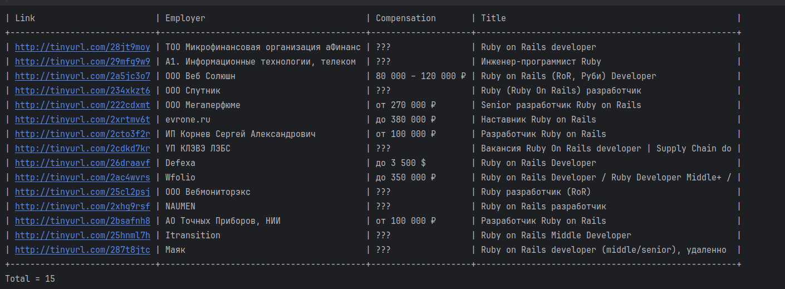

# hh-ru-parser
ruby parsing  vacancies script for job portal hh.ru

Скрипт ищет вакансии на сайте в названиях которых содержится поисковая строка

Можете использовать 2-мя способами

##  без docker
Установите руби версии 3.2.2 и при необходимость установите эту версию для проекта с помощью вашего менеджера пакетов
Используйте команду ruby index.rb название вакансии
например ruby index.rb python developer
## c docker
   docker build -t hh-ru-parser .
   docker run -it hh-ru-parser
   Выполните в терминале ruby index.rb название вакансии как в примере без докера

## Answer example:

